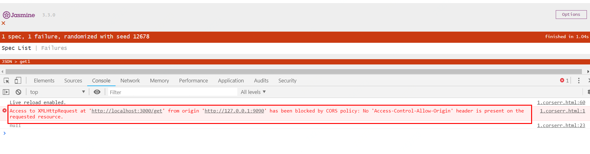
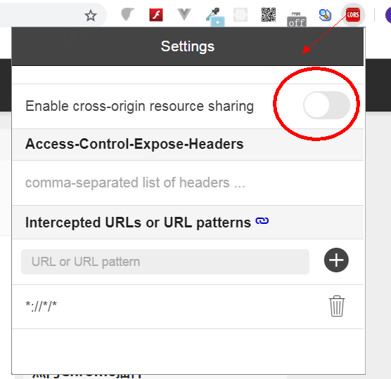

# testcors

node.js ajax cors test

## 使用

### 启动后端

进入 server 目标，运行如下命令：

```
nodemon index.js
```

# 使用 nodemon 的目的是让 index.js 热更新。

通过这个项目理清楚 ajax 跨域的知识点。

## 安装

```
npm install
```

其中：

1. express 是方便快速提供 node 服务器功能。可以使用原生的 node 代码来搭建。
2. nodemon 是为了热更新 index.js 代码。

## 启动

1. 前端

```
npm run front
```

2. 后端

```
npm run server
```

## 错误

cors 错误错误会在`同时满足`如下三个条件是发生：

1. 请求确实是跨域了
2. 你的浏览器多管闲事
3. 请求类型是 XmlRequest

注意： 一定是同时满足如上三个条件。

一个典型的例子如下：



当你启动 前端 和后端之后，打开 1.corserr.html 页面，就会在控制台看到这个错误。

既然是要同时满足如上三个条件才会出现这个错误，那么我们先来破坏一个最容易打破的条件：让你的浏览器器不要多管闲事。

## 安装 chrome 插件，允许本机跨域

百度 chrome cors 插件。
http://www.cnplugins.com/devtool/cors/download.html

安装之后，类似于：



你打开这个开关，就可以看到本例成功的样子了。

当然，这个方法不可作为解决跨域问题的方案：你总不能给你的用户都安装，并启用这个插件吧。
